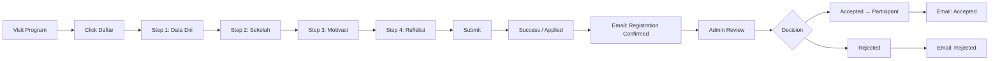

# Google Analytics 4 — Setup & Event Tracking Plan

**Status:** Draft  
**Last Updated:** 2026-05-11  
**App:** Mulai Plus (`capitveau/better-auth-admin`)

---

## Table of Contents

1. [GA4 Property Setup](#1-ga4-property-setup)
2. [Technical Implementation](#2-technical-implementation)
3. [User Identification & Custom Dimensions](#3-user-identification--custom-dimensions)
4. [Event Tracking Plan](#4-event-tracking-plan)
   - [Public Pages](#41-public-pages)
   - [Authentication](#42-authentication)
   - [Student Dashboard](#43-student-dashboard)
   - [Program Registration](#44-program-registration)
   - [Mentor Flows](#45-mentor-flows)
   - [Admin/Program Manager](#46-admin--program-manager)
   - [Payments & Orders](#47-payments--orders)
5. [E-commerce Tracking](#5-e-commerce-tracking)
6. [Implementation Phases](#6-implementation-phases)
7. [Dashboard & Reporting](#7-dashboard--reporting)

---

## 1. GA4 Property Setup

### 1.1 Create GA4 Property

```mermaid
flowchart LR
    A[Google Analytics] --> B[Create Property]
    B --> C[Property Name: "Mulai Plus"]
    C --> D[Reporting Time Zone: Asia/Jakarta]
    D --> E[Currency: IDR]
    E --> F[Get Measurement ID: G-XXXXXXXX]
```

### 1.2 Environment-Based Streams

| Environment     | Property             | Stream                 | Measurement ID | Purpose            |
| --------------- | -------------------- | ---------------------- | -------------- | ------------------ |
| **Development** | Mulai Plus (Dev)     | `localhost:3001`       | `G-XXXXX_DEV`  | Debug, testing     |
| **Staging**     | Mulai Plus (Staging) | `staging.mulaiplus.id` | `G-XXXXX_STAG` | QA, UAT validation |
| **Production**  | Mulai Plus           | `mulaiplus.id`         | `G-XXXXX_PROD` | Live analytics     |

> **Note:** Production measurement ID should be stored as `NEXT_PUBLIC_GA_MEASUREMENT_ID` in CI/CD secrets and `.env.production`.

### 1.3 Data Retention

- Set retention to **14 months** (maximum) for user-level analysis
- Enable **Google Signals** for cross-device reporting (cookie consent compliant)

---

## 2. Technical Implementation

### 2.1 Dependencies

```bash
bun add @next/third-parties  # Google Analytics component for Next.js
# or
bun add gapi-script            # Lower-level GA integration
```

### 2.2 Provider Component

Create `apps/web/src/components/analytics-provider.tsx`:

```tsx
"use client";

import { GoogleAnalytics } from "@next/third-parties/google";
import { usePathname, useSearchParams } from "next/navigation";
import { useEffect } from "react";
import { env } from "@mulai-plus/env/web";

export function AnalyticsProvider({ children }: { children: React.ReactNode }) {
  const pathname = usePathname();
  const searchParams = useSearchParams();

  useEffect(() => {
    // Page view tracking on route change
    if (typeof window !== "undefined" && window.gtag) {
      window.gtag("config", env.NEXT_PUBLIC_GA_MEASUREMENT_ID, {
        page_path:
          pathname +
          (searchParams?.toString() ? `?${searchParams.toString()}` : ""),
      });
    }
  }, [pathname, searchParams]);

  return (
    <>
      {env.NEXT_PUBLIC_GA_MEASUREMENT_ID && (
        <GoogleAnalytics gaId={env.NEXT_PUBLIC_GA_MEASUREMENT_ID} />
      )}
      {children}
    </>
  );
}
```

### 2.3 Env Variables

**`packages/env/src/web.ts`** — tambahkan:

```ts
NEXT_PUBLIC_GA_MEASUREMENT_ID: z.string().optional(),
NEXT_PUBLIC_GA_DEBUG_MODE: z
  .string()
  .optional()
  .transform((v) => v === "true"),
```

**`.env.example` / `.env.staging` / `.env.production`:**

```
# Google Analytics
NEXT_PUBLIC_GA_MEASUREMENT_ID=G-XXXXXXXX
NEXT_PUBLIC_GA_DEBUG_MODE=false
```

**CI/CD** — tambahkan:

```yaml
build-args: |
  NEXT_PUBLIC_GA_MEASUREMENT_ID=${{ secrets.NEXT_PUBLIC_GA_MEASUREMENT_ID }}
```

### 2.4 Global Event Helper

```tsx
// apps/web/src/lib/analytics.ts
type EventParams = Record<string, string | number | boolean | undefined>;

export function trackEvent(action: string, params?: EventParams) {
  if (typeof window === "undefined" || !window.gtag) return;
  window.gtag("event", action, params);
}

// Custom hook for components
export function useAnalytics() {
  const track = (action: string, params?: EventParams) => {
    trackEvent(action, {
      ...params,
      timestamp: Date.now(),
    });
  };
  return { track };
}
```

---

## 3. User Identification & Custom Dimensions

### 3.1 User ID

Set `user_id` on login/session restore for cross-device tracking.

```tsx
// Inside AnalyticsProvider or auth callback
useEffect(() => {
  if (session?.user?.id) {
    window.gtag("config", env.NEXT_PUBLIC_GA_MEASUREMENT_ID, {
      user_id: session.user.id,
    });
  }
}, [session]);
```

### 3.2 Custom Dimensions & Metrics

Register in GA Admin → Custom Definitions:

| Dimension            | Scope | Description           | Example Values                                  |
| -------------------- | ----- | --------------------- | ----------------------------------------------- |
| `user_role`          | User  | User role in app      | `student`, `mentor`, `program_manager`, `admin` |
| `user_plan`          | User  | Program/plan tier     | `free`, `premium`, `scholarship`                |
| `program_id`         | Event | Program slug/ID       | `mulai-plus-batch-1`                            |
| `batch_id`           | Event | Batch identifier      | `batch-1-jan-2026`                              |
| `application_status` | Event | Application lifecycle | `applied`, `accepted`, `rejected`               |

---

## 4. Event Tracking Plan

### 4.1 Public Pages

| Event               | Trigger                  | Parameters                                                 | Priority |
| ------------------- | ------------------------ | ---------------------------------------------------------- | -------- |
| `page_view`         | Route change (auto)      | `page_title`, `page_location`                              | **P0**   |
| `view_program`      | View program detail page | `program_id`, `program_name`                               | **P1**   |
| `view_course`       | View course detail page  | `course_id`, `course_name`, `price`                        | **P1**   |
| `program_cta_click` | Click "Daftar Sekarang"  | `program_id`, `batch_name`, `user_state` (logged_in/guest) | **P1**   |
| `browse_programs`   | Program listing page     | `program_count`, `filter_used`                             | **P2**   |
| `browse_courses`    | Course listing page      | `course_count`, `category`                                 | **P2**   |
| `program_faq_open`  | Open FAQ accordion       | `program_id`, `faq_question`                               | **P3**   |

### 4.2 Authentication

| Event                     | Trigger                | Parameters                             | Priority |
| ------------------------- | ---------------------- | -------------------------------------- | -------- |
| `login`                   | Successful login       | `method` (google/email), `role`        | **P0**   |
| `login_error`             | Failed login attempt   | `method`, `error_code`                 | **P1**   |
| `signup`                  | New user registration  | `method`, `role`                       | **P0**   |
| `signup_complete`         | Registration complete  | `method`, `role`, `has_google_account` | **P1**   |
| `logout`                  | User logout            | `role`, `session_duration_seconds`     | **P2**   |
| `password_reset_request`  | Request password reset | `has_account`                          | **P2**   |
| `password_reset_complete` | Password reset success | —                                      | **P2**   |

### 4.3 Student Dashboard

| Event                      | Trigger                   | Parameters                                                 | Priority |
| -------------------------- | ------------------------- | ---------------------------------------------------------- | -------- |
| `dashboard_view`           | View main dashboard       | `active_programs`, `upcoming_sessions`, `enrolled_courses` | **P1**   |
| `join_meeting`             | Click "Join Meeting"      | `session_id`, `program_id`, `session_type` (1on1/group)    | **P0**   |
| `view_schedule`            | Open schedule page        | `upcoming_count`, `past_count`                             | **P2**   |
| `view_certificate`         | View/download certificate | `program_id`, `program_name`                               | **P1**   |
| `application_history_view` | Expand application status | `application_count`                                        | **P3**   |
| `contact_support`          | Click contact support FAB | `channel` (wa/ig/email), `page`                            | **P2**   |
| `notification_click`       | Click notification bell   | `notification_type`, `notification_count`                  | **P2**   |

### 4.4 Program Registration

This is the **most critical funnel** — needs detailed tracking.



| Event                        | Trigger                      | Parameters                                              | Priority |
| ---------------------------- | ---------------------------- | ------------------------------------------------------- | -------- |
| `registration_start`         | Open registration dialog     | `program_id`, `batch_id`, `batch_name`                  | **P0**   |
| `registration_step_view`     | View each step               | `program_id`, `step_number`, `step_name`                | **P1**   |
| `registration_step_complete` | Complete a step & proceed    | `program_id`, `step_number`, `duration_seconds`         | **P1**   |
| `registration_abandon`       | Close dialog before submit   | `program_id`, `last_step_completed`, `duration_seconds` | **P0**   |
| `registration_submit`        | Submit registration          | `program_id`, `batch_id`, `total_duration_seconds`      | **P0**   |
| `registration_success`       | Registration API success     | `program_id`, `application_id`                          | **P0**   |
| `registration_error`         | Registration API error       | `program_id`, `error_code`, `error_message`             | **P1**   |
| `registration_resume`        | Re-open dialog after abandon | `program_id`, `abandoned_step`                          | **P2**   |

**Funnel visualization goals:**

- Step 1 → Step 2 conversion rate
- Step 2 → Step 3 conversion rate
- Step 3 → Step 4 conversion rate
- Step 4 → Submit conversion rate
- Overall registration completion rate

### 4.5 Mentor Flows

| Event                      | Trigger                      | Parameters                                          | Priority |
| -------------------------- | ---------------------------- | --------------------------------------------------- | -------- |
| `mentor_batch_view`        | Mentor views batch dashboard | `batch_id`, `program_id`, `participant_count`       | **P1**   |
| `mentor_session_create`    | Create new session           | `batch_id`, `session_type`, `student_id`            | **P1**   |
| `mentor_session_start`     | Start a mentoring session    | `session_id`, `session_type`, `is_late` (minutes)   | **P1**   |
| `mentor_session_complete`  | Mark session completed       | `session_id`, `duration_minutes`                    | **P0**   |
| `mentor_attendance_update` | Update attendance            | `batch_id`, `week`, `present_count`, `absent_count` | **P1**   |
| `mentor_progress_note`     | Add progress note            | `session_id`, `has_note`                            | **P2**   |
| `mentor_attachment_upload` | Upload session material      | `session_id`, `file_type` (pdf/video/link/tool)     | **P2**   |

### 4.6 Admin & Program Manager

| Event                      | Trigger                   | Parameters                              | Priority |
| -------------------------- | ------------------------- | --------------------------------------- | -------- |
| `admin_application_review` | Open application answers  | `program_id`, `application_status`      | **P1**   |
| `admin_application_accept` | Accept application        | `program_id`, `is_bulk`                 | **P0**   |
| `admin_application_reject` | Reject application        | `program_id`, `has_reason`, `is_bulk`   | **P0**   |
| `admin_batch_create`       | Create new batch          | `program_id`, `quota`, `duration_weeks` | **P1**   |
| `admin_mentor_assign`      | Assign mentor to batch    | `batch_id`, `mentor_count`              | **P2**   |
| `admin_program_create`     | Create new program        | `program_name`                          | **P1**   |
| `admin_email_test`         | Test email from settings  | `provider` (unosend)                    | **P3**   |
| `admin_export_data`        | Export data (users, etc.) | `export_type`, `record_count`           | **P2**   |

### 4.7 Payments & Orders

| Event                  | Trigger                      | Parameters                                       | Priority |
| ---------------------- | ---------------------------- | ------------------------------------------------ | -------- |
| `view_course_checkout` | View checkout page           | `course_id`, `course_name`, `price`              | **P1**   |
| `begin_checkout`       | Click "Beli" / start payment | `course_id`, `price`, `payment_method`           | **P0**   |
| `add_payment_info`     | Fill payment details         | `payment_method`, `payment_type`                 | **P1**   |
| `purchase`             | Successful payment           | `transaction_id`, `value`, `currency`, `items[]` | **P0**   |
| `purchase_error`       | Failed payment               | `error_code`, `payment_method`, `amount`         | **P0**   |
| `view_order_history`   | Open orders page             | `order_count`, `total_spent`                     | **P2**   |

---

## 5. E-commerce Tracking

### 5.1 GA4 Enhanced Ecommerce Events

For course purchases, implement GA4 recommended e-commerce events:

```tsx
// On checkout page view
window.gtag("event", "view_item", {
  currency: "IDR",
  value: course.price,
  items: [
    {
      item_id: course.id,
      item_name: course.title,
      item_category: course.category?.name || "General",
      price: course.price / 100, // Convert from cents
      quantity: 1,
    },
  ],
});

// On successful purchase
window.gtag("event", "purchase", {
  transaction_id: order.id,
  value: order.amount / 100,
  currency: "IDR",
  tax: 0,
  shipping: 0,
  items: [
    {
      item_id: order.courseId,
      item_name: order.course?.title,
      item_category: order.course?.category?.name || "General",
      price: order.amount / 100,
      quantity: 1,
    },
  ],
});
```

### 5.2 Currency

All monetary values should be sent in **IDR** (smallest currency unit = Rupiah). Ensure GA4 property currency is set to `IDR`.

---

## 6. Implementation Phases

### Phase 1: Foundation (Week 1)

**Goal:** Basic page views + user tracking

| Task                                                             | Est. Time | Depends On |
| ---------------------------------------------------------------- | --------- | ---------- |
| Create GA4 property + streams (dev/staging/prod)                 | 15 min    | —          |
| Install `@next/third-parties/google`                             | 5 min     | —          |
| Create `AnalyticsProvider` with route tracking                   | 1 hr      | —          |
| Add env vars to schema, .env files, CI/CD                        | 30 min    | —          |
| Set `user_id` from auth session                                  | 30 min    | Phase 1    |
| Verify tracking via GA4 DebugView                                | 30 min    | Phase 1    |
| **Deliverable:** Page views + active users + user count per role |

### Phase 2: Core Events (Week 1-2)

**Goal:** Track critical user flows

| Task                                                                             | Est. Time | Depends On |
| -------------------------------------------------------------------------------- | --------- | ---------- |
| Auth events (login, signup, login_error)                                         | 1 hr      | Phase 1    |
| Program registration funnel (start → submit → success/abandon)                   | 2 hr      | Phase 1    |
| Application accept/reject events                                                 | 1 hr      | Phase 1    |
| Mentor session start/complete events                                             | 1 hr      | Phase 1    |
| **Deliverable:** Registration funnel + session engagement + conversion dashboard |

### Phase 3: Engagement & Commerce (Week 2-3)

**Goal:** Deep engagement tracking + e-commerce

| Task                                                                         | Est. Time | Depends On |
| ---------------------------------------------------------------------------- | --------- | ---------- |
| E-commerce events (view_item, begin_checkout, purchase)                      | 2 hr      | Phase 1    |
| Custom dimensions (user_role, program_id, etc.)                              | 30 min    | Phase 1    |
| Dashboard events (join_meeting, view_certificate, contact_support)           | 1.5 hr    | Phase 1    |
| Program listing & course listing events                                      | 1 hr      | Phase 1    |
| **Deliverable:** Revenue tracking + product performance + engagement metrics |

### Phase 4: Optimization & Reports (Week 3-4)

**Goal:** Dashboards, alerts, and optimization

| Task                                                    | Est. Time | Depends On |
| ------------------------------------------------------- | --------- | ---------- |
| Create GA4 Explore reports (funnel, cohort, path)       | 1 hr      | Phase 2-3  |
| Set up conversion goals                                 | 30 min    | Phase 2-3  |
| Configure Looker Studio dashboard (if needed)           | 2 hr      | Phase 2-3  |
| Set up email alerts for funnel drops                    | 30 min    | Phase 2-3  |
| Implement cookie consent banner (GDPR/PP)               | 1 hr      | Phase 1    |
| **Deliverable:** Live dashboards + automated monitoring |

---

## 7. Dashboard & Reporting

### 7.1 Recommended GA4 Reports

| Report                   | Purpose                                | Events Used                                            |
| ------------------------ | -------------------------------------- | ------------------------------------------------------ |
| **Registration Funnel**  | Track program registration drop-off    | `registration_step_view` → `registration_submit`       |
| **Application Pipeline** | Application → Accepted/Rejected        | `admin_application_accept`, `admin_application_reject` |
| **User Acquisition**     | Where users come from                  | `signup`, `login`                                      |
| **Session Engagement**   | Mentor session volume & trends         | `mentor_session_start`, `mentor_session_complete`      |
| **Revenue Overview**     | Course sales & trends                  | `purchase`, `view_item`                                |
| **Program Performance**  | Most viewed / most registered programs | `view_program`, `registration_submit`                  |

### 7.2 Key Metrics to Monitor

| Metric                                 | Definition                    | Target |
| -------------------------------------- | ----------------------------- | ------ |
| Program Registration Funnel Conversion | Step 1 → Submit %             | > 40%  |
| Application → Participant Rate         | Accepted / Total Applications | > 50%  |
| Mentor Session Completion Rate         | Completed / Scheduled         | > 85%  |
| Google OAuth Login %                   | Google logins / Total logins  | > 70%  |
| Course Checkout → Purchase             | Purchase / Checkout starts    | > 20%  |

---

## 8. Privacy & Compliance

### 8.1 Data to Mask

- **User IP:** Enable IP anonymization in GA4 (auto in GA4)
- **User IDs:** Do NOT send PII (name, email, phone) as event parameters
- **Phone numbers:** Never track as event data

### 8.2 Cookie Consent

Implement a cookie consent banner before GA loads:

```tsx
// Only load GA if consent is given
export function AnalyticsProvider({ children }) {
  const [consent, setConsent] = useState(false);

  return (
    <>
      {consent && <GoogleAnalytics gaId={...} />}
      {!consent && <CookieBanner onAccept={() => setConsent(true)} />}
      {children}
    </>
  );
}
```

---

## Appendix: Quick Reference

### Event Naming Convention

```
{domain}_{action}[_{context}]

Examples:
- registration_step_view
- admin_application_accept
- mentor_session_complete
- payment_purchase_success
```

### Parameter Naming Convention

```
snake_case — all lowercase with underscores
Examples: program_id, batch_name, error_code, session_type
```

### Validation Checklist

Before each deployment:

- [ ] Events fire in GA4 DebugView
- [ ] No duplicate `page_view` events
- [ ] `user_id` is set for logged-in users
- [ ] No PII in event parameters
- [ ] All parameter values are strings, numbers, or booleans (no nested objects)
- [ ] Measurement ID loaded from env var, not hardcoded

INFO
Mulaiplus Production
<!-- Google tag (gtag.js) -->
<script async src="https://www.googletagmanager.com/gtag/js?id=G-BC14H4D60V"></script>
<script>
  window.dataLayer = window.dataLayer || [];
  function gtag(){dataLayer.push(arguments);}
  gtag('js', new Date());

  gtag('config', 'G-BC14H4D60V');
</script>


Mulaiplus Staging
<!-- Google tag (gtag.js) -->
<script async src="https://www.googletagmanager.com/gtag/js?id=G-FSFJ2G8W3R"></script>
<script>
  window.dataLayer = window.dataLayer || [];
  function gtag(){dataLayer.push(arguments);}
  gtag('js', new Date());

  gtag('config', 'G-FSFJ2G8W3R');
</script>

MEARSUREMENT ID
mulaiplus dev = G-FSFJ2G8W3R 
mulaiplus production =G-BC14H4D60V
